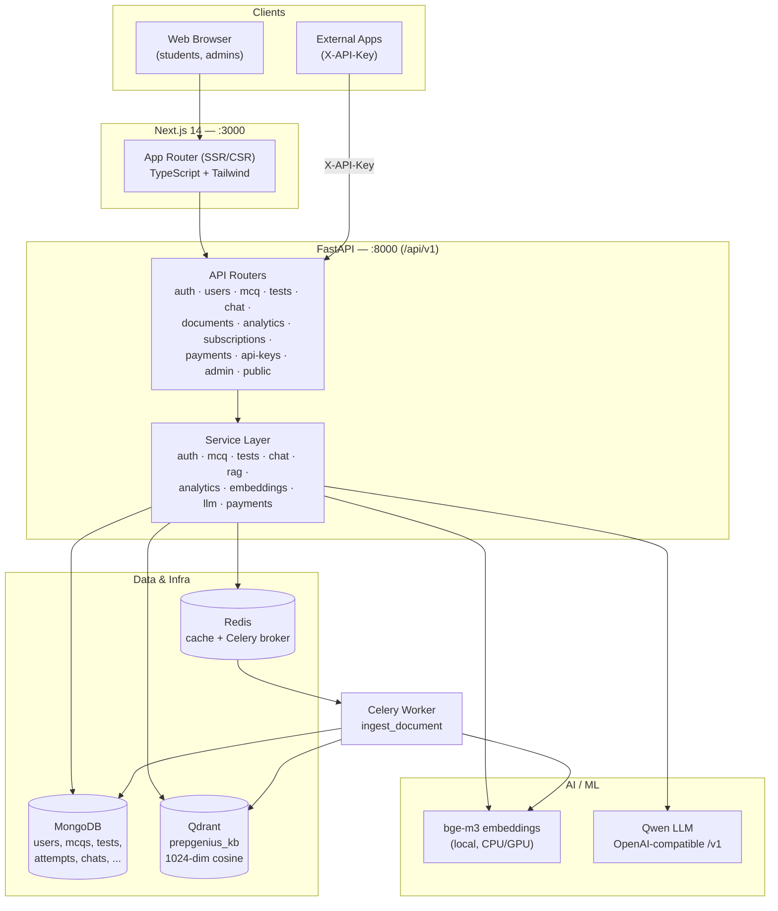
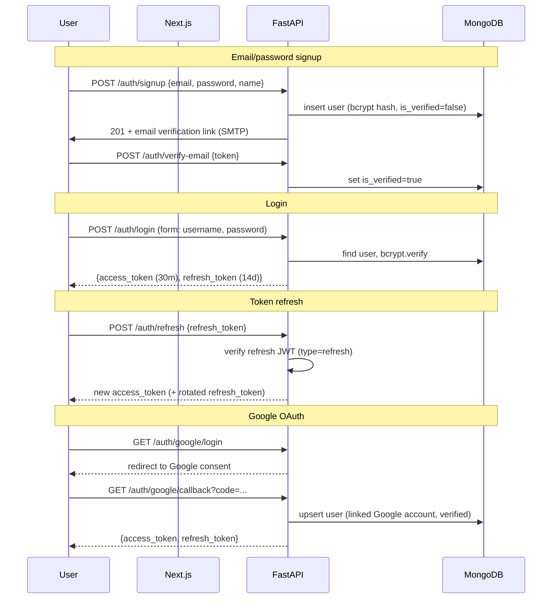

# PrepGenius — Architecture

PrepGenius is an AI-powered exam-preparation platform for Pakistani competitive
exams (FPSC, NTS, PPSC, FGEI EST, Lecturer, PMS, CSS). It combines a Next.js web
client, a FastAPI async backend, MongoDB for application data, Qdrant for vector
search, Redis for cache/queue, and a locally-hosted Qwen LLM for all generative
AI features.

---

## 1. System Overview

| Layer            | Technology                                              | Port  |
|------------------|---------------------------------------------------------|-------|
| Frontend         | Next.js 14 (App Router, TypeScript, Tailwind)           | 3000  |
| Backend API      | FastAPI (Python 3.11, async, Pydantic v2)               | 8000  |
| Application DB   | MongoDB 7 (Motor async driver)                          | 27017 |
| Vector DB        | Qdrant (`prepgenius_kb`, cosine, 1024-dim)              | 6333  |
| Cache / Queue    | Redis 7                                                 | 6379  |
| Background jobs  | Celery worker (broker/result backend on Redis)          | —     |
| Embeddings       | sentence-transformers `BAAI/bge-m3` (local, 1024-dim)   | —     |
| LLM              | Qwen (university server, OpenAI-compatible `/v1`)       | —     |

All backend routes are served under the prefix `/api/v1`.

---

## 2. Component Diagram



The browser talks only to the Next.js app and (for client-side calls) to the
FastAPI backend. The backend is the single integration point for MongoDB,
Qdrant, Redis, the embedding model, and Qwen. Heavy ingestion work is offloaded
to the Celery worker via Redis.

---

## 3. Request Lifecycle

A typical authenticated request (e.g. `POST /api/v1/mcq/generate`):

1. **Client** attaches `Authorization: Bearer <access_token>` and sends JSON.
2. **CORS middleware** validates the `Origin` against `BACKEND_CORS_ORIGINS`.
3. **Auth dependency** decodes the JWT (HS256), loads the user from MongoDB,
   and injects the `current_user` object into the route.
4. **Quota / RBAC dependency** (for metered or privileged routes) checks the
   user's plan and the `usage` collection for the day, or the `admin` role.
5. **Route handler** validates the request body with a Pydantic v2 schema.
6. **Service layer** does the work:
   - For MCQ generation: builds filters, calls the RAG service to retrieve
     context from Qdrant, then calls the Qwen client (JSON mode) to produce
     MCQs, and persists them to `mcqs`.
7. **Usage increment**: metered features bump the per-day counter in `usage`.
8. **Response** is serialized through a Pydantic response schema and returned.

For streaming chat (`POST /api/v1/chat/message`) the handler returns a
`StreamingResponse` of Server-Sent Events; tokens are forwarded from Qwen's
streaming chat completion as they arrive.

---

## 4. Authentication Flow

PrepGenius uses stateless JWT auth with separate **access** and **refresh**
tokens (HS256, signed with `SECRET_KEY`), bcrypt password hashing, Google OAuth,
and SMTP-based email verification / password reset.



Key points:

- **Access token**: short-lived (`ACCESS_TOKEN_EXPIRE_MINUTES`, default 30).
  Carries `sub` (user id), `role`, and `type=access`.
- **Refresh token**: long-lived (`REFRESH_TOKEN_EXPIRE_DAYS`, default 14),
  `type=refresh`. Exchanged at `/auth/refresh` for a fresh access token;
  refresh rotation is recommended (see `SECURITY.md`).
- **Password reset**: `/auth/forgot-password` issues a signed, time-limited
  reset token emailed to the user; `/auth/reset-password` consumes it.
- **Google OAuth**: standard authorization-code flow; callback creates or links
  a user and issues the same JWT pair.

---

## 5. Module Breakdown

| Module          | Responsibility                                                                 |
|-----------------|--------------------------------------------------------------------------------|
| **auth**        | Signup, login, JWT issue/verify/refresh, Google OAuth, email verify, password reset. |
| **users**       | Profile read/update, change password, usage/quota readout.                     |
| **mcq**         | Dynamic MCQ generation (test_type/subject/topic/difficulty aware, batched), listing, explanations — all via RAG + Qwen. |
| **tests**       | Build full/subject/topic mock tests, start attempts, server-side grading, results, per-topic review/analytics. |
| **chat**        | GPT-style conversations with persisted history and SSE streaming; optional RAG toggle for grounded answers. |
| **rag**         | Document ingestion, chunking, embedding, Qdrant upsert, filtered retrieval with progressive fallback, prompt-context injection. |
| **analytics**   | Performance overview, weak-area analysis (LLM JSON), study plans, topic recommendations. |
| **payments**    | JazzCash + Easypaisa hosted-checkout (secure-hash signing), callbacks, payment history. |
| **subscriptions** | Plan catalog (Free/Pro/Premium), current subscription, cancel.               |
| **admin**       | User management, subject/topic CRUD, document uploads, system logs, platform analytics, revenue, API-key oversight. |
| **public API**  | External access via `X-API-Key` to `/public/mcqs`, `/public/ask`, `/public/explain`; usage metered per key. |

---

## 6. Backend Folder Structure

```
backend/
├── Dockerfile
├── requirements.txt
└── app/
    ├── main.py                 # FastAPI app, middleware, router registration, lifespan
    ├── core/                   # cross-cutting concerns
    │   ├── config.py           # Pydantic Settings (reads .env)
    │   ├── security.py         # bcrypt, JWT encode/decode, token types
    │   └── deps.py             # FastAPI dependencies: current_user, require_admin, quota
    ├── db/
    │   ├── mongo.py            # Motor client, get_db(), index creation
    │   └── qdrant.py           # Qdrant client, collection bootstrap, payload indexes
    ├── models/                 # internal domain models / Mongo document shapes
    │   ├── user.py  subject.py  topic.py  mcq.py  test.py
    │   ├── attempt.py  chat.py  document.py  subscription.py  api_key.py ...
    ├── schemas/                # Pydantic v2 request/response schemas
    │   ├── auth.py  user.py  mcq.py  test.py  chat.py
    │   ├── analytics.py  payment.py  api_key.py  admin.py ...
    ├── api/
    │   └── v1/                 # one router module per domain
    │       ├── router.py       # aggregates all sub-routers under /api/v1
    │       ├── auth.py  users.py  mcq.py  tests.py  chat.py
    │       ├── documents.py  analytics.py  subscriptions.py
    │       ├── payments.py  api_keys.py  admin.py  public.py
    ├── services/               # business logic (no HTTP concerns)
    │   ├── auth_service.py  mcq_service.py  test_service.py
    │   ├── chat_service.py  rag_service.py  embedding_service.py
    │   ├── llm_service.py   # Qwen OpenAI-compatible client wrapper
    │   ├── analytics_service.py  document_service.py
    │   ├── usage_service.py # quota counters in `usage`
    │   └── payments/
    │       ├── base.py  jazzcash.py  easypaisa.py   # secure-hash signing
    ├── workers/
    │   ├── celery_app.py        # Celery app bound to Redis broker/backend
    │   └── tasks.py             # ingest_document task (+ inline fallback)
    ├── scripts/
    │   └── seed.py              # `python -m app.scripts.seed` — subjects/topics/admin
    └── utils/
        ├── text.py             # text extraction (PDF/DOCX/TXT), word-chunking
        ├── email.py            # SMTP send (verify / reset)
        └── logging.py          # system_logs writer
```

---

## 7. Quotas, RBAC & Rate Limiting

### Plans & quotas
- **Free**: daily limits enforced via the `usage` collection — `FREE_DAILY_MCQS`
  (20), `FREE_DAILY_CHAT` (15), `FREE_DAILY_MOCKTESTS` (1).
- **Pro** (PKR 999/mo) and **Premium** (PKR 2499/mo): unlimited AI usage.

Quota enforcement: each metered request runs a dependency that reads/creates a
document in `usage` keyed by `(user_id, date)` (unique index). If the user is on
a paid, active subscription the check is skipped; otherwise the relevant counter
(`mcq` / `chat` / `mocktest`) is checked against the limit and atomically
incremented. Exceeding a limit returns `429 Too Many Requests`.

### RBAC
- Two roles: `user` and `admin`, stored on the user document and embedded in the
  JWT `role` claim.
- Admin-only routes (`/api/v1/admin/*`) use a `require_admin` dependency that
  rejects non-admin tokens with `403`.

### Rate limiting
- Public API keys are metered per key (recorded in `usage` / key usage) and can
  carry an optional expiry.
- Network-level / per-IP rate limiting is recommended at the reverse proxy
  (Nginx/Caddy) and/or via `slowapi` backed by Redis — see `SECURITY.md` and
  `DEPLOYMENT.md`.

---

## 8. Technology Choices & Rationale

| Choice | Why |
|--------|-----|
| **Next.js 14 (App Router)** | SSR/streaming for fast first paint, file-based routing, strong TS + Tailwind ergonomics for a content-heavy study UI. |
| **FastAPI (async)** | Native async fits I/O-bound LLM/DB/vector calls; Pydantic v2 gives typed validation and auto OpenAPI docs. |
| **MongoDB (Motor)** | Flexible document model suits heterogeneous content (MCQs, attempts, chats, study plans) and async access. |
| **Qdrant** | Purpose-built vector DB with payload filtering (test_type/subject/topic), so retrieval can be scoped precisely; runs locally in Docker. |
| **bge-m3 embeddings** | Multilingual (English + Urdu) — essential for Islamic Studies, Urdu, and Pakistan-affairs content; 1024-dim, normalized, runs locally (no per-call cost or data leaving the cluster). |
| **Qwen (OpenAI-compatible)** | Hosted on the university server, so it is cost-free and private; the OpenAI SDK + `/v1` API means standard chat/streaming/JSON modes and easy model swaps. |
| **Redis + Celery** | Decouples slow PDF/doc ingestion from request latency; Redis doubles as a cache/quota store. |
| **JazzCash + Easypaisa** | The dominant mobile-wallet rails in Pakistan; hosted checkout with secure-hash signing keeps card/wallet data off our servers. |
| **Docker Compose** | One-command local stack and a clean baseline for production orchestration. |
