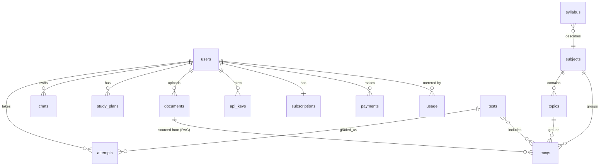

# PrepGenius — Database Schema

PrepGenius stores application data in **MongoDB 7** (accessed asynchronously via
Motor) and vector data in **Qdrant**. This document describes every MongoDB
collection with field-level schemas, relationships, indexes, and example
documents, plus the Qdrant payload schema.

> Conventions: `_id` is a MongoDB `ObjectId` unless noted. Timestamps are UTC
> `datetime`. `id` references are stored as strings (stringified `ObjectId`) for
> easy JSON round-tripping unless otherwise stated.

---

## 1. Entity Relationships



---

## 2. Collections

### 2.1 `users`

| Field | Type | Required | Default | Notes |
|-------|------|----------|---------|-------|
| `_id` | ObjectId | yes | auto | |
| `email` | string | yes | — | lowercased; **unique index** |
| `name` | string | yes | — | display name |
| `password_hash` | string | no | null | bcrypt; null for Google-only accounts |
| `role` | string | yes | `"user"` | `user` \| `admin` |
| `auth_provider` | string | yes | `"local"` | `local` \| `google` |
| `google_id` | string | no | null | set for OAuth users |
| `is_verified` | bool | yes | `false` | email verified |
| `is_active` | bool | yes | `true` | admin can disable |
| `target_exams` | string[] | no | `[]` | e.g. `["CSS","PMS"]` |
| `created_at` | datetime | yes | now | |
| `updated_at` | datetime | yes | now | |

**Indexes:** `email` (unique).

```json
{
  "_id": "665f1a2b3c4d5e6f7a8b9c0d",
  "email": "ahsan@oraclaim.com",
  "name": "Ahsan",
  "password_hash": "$2b$12$...",
  "role": "user",
  "auth_provider": "local",
  "google_id": null,
  "is_verified": true,
  "is_active": true,
  "target_exams": ["CSS", "PMS"],
  "created_at": "2026-06-01T09:00:00Z",
  "updated_at": "2026-06-20T12:30:00Z"
}
```

---

### 2.2 `subjects`

| Field | Type | Required | Default | Notes |
|-------|------|----------|---------|-------|
| `_id` | ObjectId | yes | auto | |
| `name` | string | yes | — | e.g. "Pakistan Affairs" |
| `slug` | string | yes | — | **unique index** |
| `test_types` | string[] | yes | `[]` | applicable exams: FPSC/NTS/PPSC/EST/Lecturer/PMS/CSS |
| `description` | string | no | "" | |
| `order` | int | no | 0 | display ordering |
| `created_at` | datetime | yes | now | |

**Indexes:** `slug` (unique).

```json
{
  "_id": "66700000000000000000a001",
  "name": "Pakistan Affairs",
  "slug": "pakistan-affairs",
  "test_types": ["CSS", "PMS", "PPSC", "FPSC"],
  "description": "History, geography, and current affairs of Pakistan.",
  "order": 3,
  "created_at": "2026-05-01T00:00:00Z"
}
```

---

### 2.3 `topics`

| Field | Type | Required | Default | Notes |
|-------|------|----------|---------|-------|
| `_id` | ObjectId | yes | auto | |
| `subject_id` | string | yes | — | → `subjects._id` |
| `name` | string | yes | — | |
| `slug` | string | yes | — | unique within subject |
| `description` | string | no | "" | |
| `order` | int | no | 0 | |
| `created_at` | datetime | yes | now | |

**Indexes:** `subject_id`; `(subject_id, slug)`.

```json
{
  "_id": "66700000000000000000b010",
  "subject_id": "66700000000000000000a001",
  "name": "Ideology of Pakistan",
  "slug": "ideology-of-pakistan",
  "description": "Two-Nation Theory, Aligarh Movement, Pakistan Resolution.",
  "order": 1,
  "created_at": "2026-05-01T00:00:00Z"
}
```

---

### 2.4 `mcqs`

| Field | Type | Required | Default | Notes |
|-------|------|----------|---------|-------|
| `_id` | ObjectId | yes | auto | |
| `question` | string | yes | — | stem |
| `options` | string[] | yes | — | exactly 4 |
| `correct_index` | int | yes | — | 0–3 |
| `explanation` | string | no | "" | LLM-generated rationale |
| `test_type` | string | yes | — | FPSC/NTS/PPSC/EST/Lecturer/PMS/CSS |
| `subject_id` | string | yes | — | → `subjects._id` |
| `topic_id` | string | no | null | → `topics._id` |
| `difficulty` | string | yes | `"medium"` | `easy` \| `medium` \| `hard` |
| `source` | string | yes | `"ai"` | `ai` \| `imported` |
| `doc_id` | string | no | null | RAG source document, if any |
| `created_by` | string | no | null | user/admin id |
| `created_at` | datetime | yes | now | |

**Indexes:** `(test_type, subject_id, topic_id)`; `difficulty`;
**text index** on `question` + `explanation` (full-text search).

```json
{
  "_id": "66710000000000000000c100",
  "question": "The Lahore Resolution was passed in which year?",
  "options": ["1930", "1940", "1947", "1956"],
  "correct_index": 1,
  "explanation": "The Lahore Resolution (Pakistan Resolution) was passed on 23 March 1940.",
  "test_type": "CSS",
  "subject_id": "66700000000000000000a001",
  "topic_id": "66700000000000000000b010",
  "difficulty": "easy",
  "source": "ai",
  "doc_id": "66720000000000000000d200",
  "created_by": "665f1a2b3c4d5e6f7a8b9c0d",
  "created_at": "2026-06-10T08:15:00Z"
}
```

---

### 2.5 `tests`

| Field | Type | Required | Default | Notes |
|-------|------|----------|---------|-------|
| `_id` | ObjectId | yes | auto | |
| `title` | string | yes | — | |
| `kind` | string | yes | — | `full` \| `subject` \| `topic` |
| `test_type` | string | yes | — | exam family |
| `subject_id` | string | no | null | for subject/topic tests |
| `topic_id` | string | no | null | for topic tests |
| `mcq_ids` | string[] | yes | — | ordered → `mcqs._id` |
| `duration_minutes` | int | yes | — | time limit |
| `created_by` | string | yes | — | user/admin id |
| `created_at` | datetime | yes | now | |

**Indexes:** `(test_type, kind)`; `created_by`.

```json
{
  "_id": "66730000000000000000e300",
  "title": "CSS — Pakistan Affairs Mock",
  "kind": "subject",
  "test_type": "CSS",
  "subject_id": "66700000000000000000a001",
  "topic_id": null,
  "mcq_ids": ["66710000000000000000c100", "66710000000000000000c101"],
  "duration_minutes": 30,
  "created_by": "665f1a2b3c4d5e6f7a8b9c0d",
  "created_at": "2026-06-12T10:00:00Z"
}
```

---

### 2.6 `attempts`

Server-side grading results for a started test.

| Field | Type | Required | Default | Notes |
|-------|------|----------|---------|-------|
| `_id` | ObjectId | yes | auto | |
| `test_id` | string | yes | — | → `tests._id` |
| `user_id` | string | yes | — | → `users._id` |
| `status` | string | yes | `"in_progress"` | `in_progress` \| `submitted` |
| `answers` | object[] | no | `[]` | `{mcq_id, selected_index}` |
| `score` | float | no | null | computed at submit |
| `total` | int | no | null | number of questions |
| `correct` | int | no | null | count correct |
| `per_topic` | object | no | `{}` | `{topic_id: {correct, total}}` analytics |
| `started_at` | datetime | yes | now | |
| `submitted_at` | datetime | no | null | |

**Indexes:** `(user_id, status)`; `test_id`.

```json
{
  "_id": "66740000000000000000f400",
  "test_id": "66730000000000000000e300",
  "user_id": "665f1a2b3c4d5e6f7a8b9c0d",
  "status": "submitted",
  "answers": [
    {"mcq_id": "66710000000000000000c100", "selected_index": 1},
    {"mcq_id": "66710000000000000000c101", "selected_index": 0}
  ],
  "score": 50.0,
  "total": 2,
  "correct": 1,
  "per_topic": {"66700000000000000000b010": {"correct": 1, "total": 2}},
  "started_at": "2026-06-13T09:00:00Z",
  "submitted_at": "2026-06-13T09:22:00Z"
}
```

---

### 2.7 `chats`

A conversation with persisted message history.

| Field | Type | Required | Default | Notes |
|-------|------|----------|---------|-------|
| `_id` | ObjectId | yes | auto | |
| `user_id` | string | yes | — | → `users._id` |
| `title` | string | yes | `"New chat"` | auto/edited |
| `rag_enabled` | bool | yes | `false` | grounds answers via RAG |
| `messages` | object[] | yes | `[]` | `{role, content, created_at}` |
| `created_at` | datetime | yes | now | |
| `updated_at` | datetime | yes | now | |

`role` ∈ `system` \| `user` \| `assistant`.

**Indexes:** `(user_id, updated_at)`.

```json
{
  "_id": "66750000000000000000a500",
  "user_id": "665f1a2b3c4d5e6f7a8b9c0d",
  "title": "Indus Waters Treaty",
  "rag_enabled": true,
  "messages": [
    {"role": "user", "content": "Explain the Indus Waters Treaty.", "created_at": "2026-06-14T11:00:00Z"},
    {"role": "assistant", "content": "The Indus Waters Treaty (1960)...", "created_at": "2026-06-14T11:00:04Z"}
  ],
  "created_at": "2026-06-14T11:00:00Z",
  "updated_at": "2026-06-14T11:00:04Z"
}
```

---

### 2.8 `study_plans`

| Field | Type | Required | Default | Notes |
|-------|------|----------|---------|-------|
| `_id` | ObjectId | yes | auto | |
| `user_id` | string | yes | — | → `users._id` |
| `test_type` | string | yes | — | target exam |
| `horizon_days` | int | yes | — | plan length |
| `plan` | object | yes | — | LLM-generated JSON (days → tasks) |
| `created_at` | datetime | yes | now | |

**Indexes:** `(user_id, created_at)`.

```json
{
  "_id": "66760000000000000000b600",
  "user_id": "665f1a2b3c4d5e6f7a8b9c0d",
  "test_type": "CSS",
  "horizon_days": 30,
  "plan": {
    "days": [
      {"day": 1, "focus": "Pakistan Affairs — Ideology", "tasks": ["Read notes", "20 MCQs"]}
    ]
  },
  "created_at": "2026-06-15T07:00:00Z"
}
```

---

### 2.9 `documents`

Uploaded source files for RAG.

| Field | Type | Required | Default | Notes |
|-------|------|----------|---------|-------|
| `_id` | ObjectId | yes | auto | |
| `filename` | string | yes | — | original name |
| `path` | string | yes | — | stored path under `UPLOAD_DIR` |
| `mime` | string | yes | — | pdf/docx/txt |
| `size_bytes` | int | yes | — | |
| `test_type` | string | no | null | tagging for retrieval filters |
| `subject_id` | string | no | null | tagging |
| `topic_id` | string | no | null | tagging |
| `kind` | string | yes | `"notes"` | `syllabus`\|`past_paper`\|`current_affairs`\|`book`\|`notes` |
| `status` | string | yes | `"pending"` | `pending`\|`processing`\|`indexed`\|`failed` |
| `chunk_count` | int | no | 0 | chunks upserted to Qdrant |
| `uploaded_by` | string | yes | — | → `users._id` |
| `created_at` | datetime | yes | now | |

**Indexes:** `(test_type, subject_id, topic_id)`; `status`; `uploaded_by`.

```json
{
  "_id": "66720000000000000000d200",
  "filename": "pak-affairs-notes.pdf",
  "path": "/data/uploads/66720000000000000000d200.pdf",
  "mime": "application/pdf",
  "size_bytes": 1843200,
  "test_type": "CSS",
  "subject_id": "66700000000000000000a001",
  "topic_id": null,
  "kind": "notes",
  "status": "indexed",
  "chunk_count": 142,
  "uploaded_by": "665f1a2b3c4d5e6f7a8b9c0d",
  "created_at": "2026-06-09T14:00:00Z"
}
```

---

### 2.10 `syllabus`

Structured syllabus entries per exam (used for filtering and plan generation).

| Field | Type | Required | Default | Notes |
|-------|------|----------|---------|-------|
| `_id` | ObjectId | yes | auto | |
| `test_type` | string | yes | — | exam family |
| `subject_id` | string | no | null | → `subjects._id` |
| `title` | string | yes | — | section/heading |
| `items` | string[] | no | `[]` | sub-topics |
| `created_at` | datetime | yes | now | |

**Indexes:** `(test_type, subject_id)`.

---

### 2.11 `api_keys`

| Field | Type | Required | Default | Notes |
|-------|------|----------|---------|-------|
| `_id` | ObjectId | yes | auto | |
| `user_id` | string | yes | — | owner → `users._id` |
| `name` | string | yes | — | label |
| `key_hash` | string | yes | — | **sha256** of plaintext; **unique index** |
| `prefix` | string | yes | — | first chars shown in UI |
| `scopes` | string[] | yes | `[]` | `mcq` \| `chat` |
| `expires_at` | datetime | no | null | optional expiry |
| `last_used_at` | datetime | no | null | |
| `revoked` | bool | yes | `false` | |
| `created_at` | datetime | yes | now | |

The plaintext key is shown **once** at creation; only the sha256 hash is stored.

**Indexes:** `key_hash` (unique); `user_id`.

```json
{
  "_id": "66770000000000000000c700",
  "user_id": "665f1a2b3c4d5e6f7a8b9c0d",
  "name": "Mobile app key",
  "key_hash": "9f86d081884c7d659a2feaa0c55ad015a3bf4f1b2b0b822cd15d6c15b0f00a08",
  "prefix": "pg_live_a1b2",
  "scopes": ["mcq", "chat"],
  "expires_at": null,
  "last_used_at": "2026-06-23T18:00:00Z",
  "revoked": false,
  "created_at": "2026-06-02T10:00:00Z"
}
```

---

### 2.12 `subscriptions`

| Field | Type | Required | Default | Notes |
|-------|------|----------|---------|-------|
| `_id` | ObjectId | yes | auto | |
| `user_id` | string | yes | — | **one active per user** → `users._id` |
| `plan` | string | yes | `"free"` | `free` \| `pro` \| `premium` |
| `status` | string | yes | `"active"` | `active`\|`canceled`\|`expired` |
| `provider` | string | no | null | `jazzcash` \| `easypaisa` |
| `amount_pkr` | int | no | 0 | 0 / 999 / 2499 |
| `current_period_end` | datetime | no | null | renewal/expiry |
| `created_at` | datetime | yes | now | |
| `updated_at` | datetime | yes | now | |

**Indexes:** `user_id`; `status`.

```json
{
  "_id": "66780000000000000000d800",
  "user_id": "665f1a2b3c4d5e6f7a8b9c0d",
  "plan": "pro",
  "status": "active",
  "provider": "jazzcash",
  "amount_pkr": 999,
  "current_period_end": "2026-07-20T00:00:00Z",
  "created_at": "2026-06-20T00:00:00Z",
  "updated_at": "2026-06-20T00:00:00Z"
}
```

---

### 2.13 `payments`

| Field | Type | Required | Default | Notes |
|-------|------|----------|---------|-------|
| `_id` | ObjectId | yes | auto | |
| `user_id` | string | yes | — | → `users._id` |
| `provider` | string | yes | — | `jazzcash` \| `easypaisa` |
| `plan` | string | yes | — | `pro` \| `premium` |
| `amount_pkr` | int | yes | — | 999 / 2499 |
| `currency` | string | yes | `"PKR"` | |
| `txn_ref` | string | yes | — | provider transaction ref |
| `status` | string | yes | `"initiated"` | `initiated`\|`success`\|`failed` |
| `raw_callback` | object | no | null | provider callback payload (audit) |
| `created_at` | datetime | yes | now | |
| `updated_at` | datetime | yes | now | |

**Indexes:** `user_id`; `txn_ref`; `status`.

```json
{
  "_id": "66790000000000000000e900",
  "user_id": "665f1a2b3c4d5e6f7a8b9c0d",
  "provider": "jazzcash",
  "plan": "pro",
  "amount_pkr": 999,
  "currency": "PKR",
  "txn_ref": "T20260620120000",
  "status": "success",
  "raw_callback": {"pp_ResponseCode": "000"},
  "created_at": "2026-06-20T11:59:00Z",
  "updated_at": "2026-06-20T12:00:05Z"
}
```

---

### 2.14 `usage`

Per-user, per-day quota counters.

| Field | Type | Required | Default | Notes |
|-------|------|----------|---------|-------|
| `_id` | ObjectId | yes | auto | |
| `user_id` | string | yes | — | → `users._id` |
| `date` | string | yes | — | `YYYY-MM-DD` (UTC) |
| `mcq` | int | yes | 0 | MCQs generated today |
| `chat` | int | yes | 0 | chat messages today |
| `mocktest` | int | yes | 0 | mock tests started today |
| `updated_at` | datetime | yes | now | |

**Indexes:** `(user_id, date)` (**unique**).

```json
{
  "_id": "667a0000000000000000fa00",
  "user_id": "665f1a2b3c4d5e6f7a8b9c0d",
  "date": "2026-06-24",
  "mcq": 12,
  "chat": 5,
  "mocktest": 1,
  "updated_at": "2026-06-24T13:00:00Z"
}
```

---

### 2.15 `system_logs`

Audit/operational log entries (admin-visible).

| Field | Type | Required | Default | Notes |
|-------|------|----------|---------|-------|
| `_id` | ObjectId | yes | auto | |
| `level` | string | yes | `"info"` | `info`\|`warning`\|`error` |
| `event` | string | yes | — | e.g. `document.indexed`, `auth.login` |
| `user_id` | string | no | null | actor, if any |
| `meta` | object | no | `{}` | structured context |
| `created_at` | datetime | yes | now | |

**Indexes:** `created_at`; `level`.

---

## 3. Index Summary

| Collection | Index | Type |
|------------|-------|------|
| users | `email` | unique |
| subjects | `slug` | unique |
| topics | `subject_id`, `(subject_id, slug)` | normal / compound |
| mcqs | `(test_type, subject_id, topic_id)`, `difficulty` | compound / normal |
| mcqs | `question` + `explanation` | **text** |
| tests | `(test_type, kind)`, `created_by` | compound / normal |
| attempts | `(user_id, status)`, `test_id` | compound / normal |
| chats | `(user_id, updated_at)` | compound |
| study_plans | `(user_id, created_at)` | compound |
| documents | `(test_type, subject_id, topic_id)`, `status`, `uploaded_by` | compound / normal |
| syllabus | `(test_type, subject_id)` | compound |
| api_keys | `key_hash` (unique), `user_id` | unique / normal |
| subscriptions | `user_id`, `status` | normal |
| payments | `user_id`, `txn_ref`, `status` | normal |
| usage | `(user_id, date)` | **unique** |
| system_logs | `created_at`, `level` | normal |

---

## 4. Qdrant Payload Schema

Single collection **`prepgenius_kb`** — vectors are 1024-dim, distance **cosine**
(bge-m3 embeddings, L2-normalized).

| Payload field | Type | Indexed | Purpose |
|---------------|------|---------|---------|
| `doc_id` | string (keyword) | yes | source document → `documents._id` |
| `test_type` | string (keyword) | yes | exam scope (FPSC/NTS/PPSC/EST/CSS…) |
| `subject_id` | string (keyword) | yes | subject scope |
| `topic_id` | string (keyword) | yes | topic scope |
| `kind` | string (keyword) | yes | `syllabus`\|`past_paper`\|`current_affairs`\|`book`\|`notes` |
| `chunk_index` | int | no | order within document |
| `text` | string | no | the chunk text (returned for context) |
| `filename` | string | no | display/source attribution |

Point id: deterministic per `(doc_id, chunk_index)` so re-ingestion is
idempotent. The payload indexes on `test_type/subject_id/topic_id/doc_id/kind`
enable fast filtered retrieval and the progressive filter-relaxation fallback
described in `RAG.md`.

```json
{
  "id": "66720000000000000000d200#17",
  "vector": [0.013, -0.041, "...(1024 dims)..."],
  "payload": {
    "doc_id": "66720000000000000000d200",
    "test_type": "CSS",
    "subject_id": "66700000000000000000a001",
    "topic_id": "66700000000000000000b010",
    "kind": "notes",
    "chunk_index": 17,
    "text": "The Pakistan Resolution, passed on 23 March 1940 in Lahore...",
    "filename": "pak-affairs-notes.pdf"
  }
}
```
