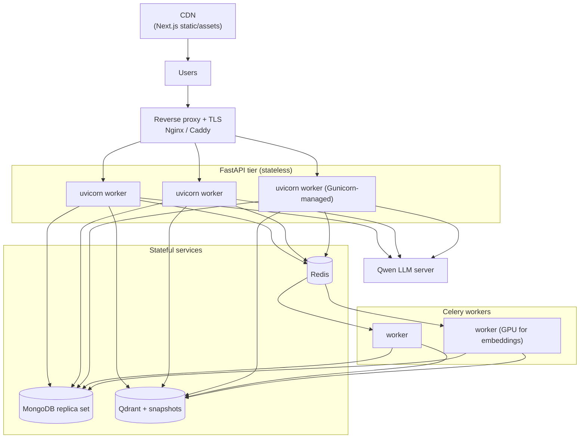

# PrepGenius — Deployment

This guide covers local development with Docker Compose and a production
deployment hardened for thousands of concurrent users.

---

## 1. Local Development

### Prerequisites
- Docker + Docker Compose
- A reachable Qwen endpoint (university server, OpenAI-compatible `/v1`)

### Steps
```bash
# 1. Configure environment
cp .env.example .env
#   edit .env: set SECRET_KEY, QWEN_BASE_URL/QWEN_MODEL, SMTP_*, payment creds...

# 2. Start the full stack (mongo, qdrant, redis, backend, worker, frontend)
docker compose up --build

# 3. Seed subjects/topics and the bootstrap admin
docker compose exec backend python -m app.scripts.seed
```

Services after start-up:

| Service  | URL / Port |
|----------|------------|
| Frontend (Next.js) | http://localhost:3000 |
| Backend (FastAPI)  | http://localhost:8000 (docs at `/docs`) |
| MongoDB  | localhost:27017 |
| Qdrant   | localhost:6333 (gRPC 6334) |
| Redis    | localhost:6379 |
| Worker   | Celery (no port) |

The seed script reads `ADMIN_EMAIL` / `ADMIN_PASSWORD` from `.env` to create the
first admin, and inserts the base subjects/topics/syllabus.

> The first backend/worker start downloads `BAAI/bge-m3` into the
> `models_cache` volume (one-time, multi-hundred-MB). Subsequent starts are fast.

---

## 2. Environment Variables Reference

| Variable | Example / Default | Description |
|----------|-------------------|-------------|
| `ENVIRONMENT` | `development` | `development`\|`staging`\|`production` |
| `PROJECT_NAME` | `PrepGenius` | app name |
| `API_V1_PREFIX` | `/api/v1` | API route prefix |
| `BACKEND_CORS_ORIGINS` | `http://localhost:3000,...` | comma-separated allowed origins |
| `SECRET_KEY` | (64-char random) | JWT signing secret |
| `ACCESS_TOKEN_EXPIRE_MINUTES` | `30` | access token TTL |
| `REFRESH_TOKEN_EXPIRE_DAYS` | `14` | refresh token TTL |
| `ALGORITHM` | `HS256` | JWT algorithm |
| `MONGO_URI` | `mongodb://mongo:27017` | MongoDB connection |
| `MONGO_DB` | `prepgenius` | database name |
| `QDRANT_URL` | `http://qdrant:6333` | Qdrant endpoint |
| `QDRANT_API_KEY` | (empty) | Qdrant key (prod) |
| `QDRANT_COLLECTION` | `prepgenius_kb` | vector collection |
| `REDIS_URL` | `redis://redis:6379/0` | cache |
| `CELERY_BROKER_URL` | `redis://redis:6379/1` | Celery broker |
| `CELERY_RESULT_BACKEND` | `redis://redis:6379/2` | Celery results |
| `EMBEDDING_MODEL` | `BAAI/bge-m3` | embedding model |
| `EMBEDDING_DIM` | `1024` | vector size |
| `EMBEDDING_DEVICE` | `cpu` | `cpu`\|`cuda` |
| `QWEN_BASE_URL` | `http://...:8000/v1` | LLM endpoint |
| `QWEN_API_KEY` | `not-needed-or-your-key` | LLM key |
| `QWEN_MODEL` | `Qwen2.5-72B-Instruct` | model id |
| `QWEN_TIMEOUT` / `QWEN_MAX_TOKENS` / `QWEN_TEMPERATURE` | `120` / `2048` / `0.4` | LLM params |
| `GOOGLE_CLIENT_ID` / `GOOGLE_CLIENT_SECRET` / `GOOGLE_REDIRECT_URI` | — | OAuth |
| `SMTP_HOST` / `SMTP_PORT` / `SMTP_USER` / `SMTP_PASSWORD` / `SMTP_FROM` | — | email |
| `FRONTEND_URL` | `http://localhost:3000` | links in emails |
| `ADMIN_EMAIL` / `ADMIN_PASSWORD` | — | bootstrap admin (seed) |
| `JAZZCASH_*` | merchant id/password/salt/return url/env | JazzCash |
| `EASYPAISA_*` | store id/hash key/return url/env | Easypaisa |
| `FREE_DAILY_MCQS` / `FREE_DAILY_CHAT` / `FREE_DAILY_MOCKTESTS` | `20` / `15` / `1` | free quotas |
| `MAX_UPLOAD_MB` | `50` | upload size cap |
| `UPLOAD_DIR` | `/data/uploads` | document storage |

---

## 3. Production Deployment

### 3.1 Topology



### 3.2 Reverse proxy + TLS

Terminate TLS at Nginx or Caddy and proxy to the API and frontend.

Caddy (automatic Let's Encrypt) example:
```caddyfile
api.prepgenius.pk {
    reverse_proxy backend:8000
    encode gzip
}
prepgenius.pk {
    reverse_proxy frontend:3000
    encode gzip
}
```

Nginx essentials: forward `X-Forwarded-For`/`Proto`, raise `client_max_body_size`
to match `MAX_UPLOAD_MB`, and for SSE chat set `proxy_buffering off;` and a long
`proxy_read_timeout` so streamed tokens are not buffered.

### 3.3 Separate production compose

Use a `docker-compose.prod.yml` override that:
- removes dev bind-mounts and `--reload`,
- runs the API under Gunicorn with uvicorn workers,
- pins image tags, sets `restart: always`, and adds resource limits,
- keeps secrets in an env file or a secrets manager (never committed).

API command for production:
```yaml
command: gunicorn app.main:app \
  -k uvicorn.workers.UvicornWorker \
  -w 4 --bind 0.0.0.0:8000 --timeout 120 --graceful-timeout 30
```

Run with:
```bash
docker compose -f docker-compose.yml -f docker-compose.prod.yml up -d
```

### 3.4 Scaling

- **API tier**: the API is stateless (JWT auth, no server session), so scale
  horizontally — multiple uvicorn workers per container (Gunicorn `-w N`) and
  multiple API replicas behind the load balancer.
- **Workers**: run multiple Celery workers; scale ingestion throughput by adding
  worker replicas. Put the embedding-heavy workers on GPU nodes.
- **MongoDB**: deploy a **replica set** (primary + secondaries) for HA and read
  scaling; ensure all indexes from `DATABASE.md` exist; enable auth.
- **Qdrant**: persist the storage volume, take periodic **snapshots**, and use an
  API key. Scale vertically first; cluster/shard for very large knowledge bases.
- **Redis**: use a managed/HA Redis (or Sentinel) — it backs both cache and the
  Celery broker.
- **Embedding model on GPU**: set `EMBEDDING_DEVICE=cuda` and run the
  backend/worker on GPU hosts with the NVIDIA runtime; keep the HF model-cache
  volume warm.

### 3.5 Health checks

- MongoDB: `db.adminCommand('ping')` (already in compose).
- API: add a lightweight `GET /healthz` that checks Mongo/Qdrant/Redis
  connectivity; wire it into the load balancer and the container `healthcheck`.
- Qdrant: `GET /readyz`. Redis: `redis-cli ping`.

### 3.6 Backups

- **MongoDB**: scheduled `mongodump` (or replica-set snapshots) to off-site
  storage; test restores.
- **Qdrant**: scheduled snapshots of the collection; store off-site so the KB can
  be rebuilt without re-ingesting.
- **Uploads**: back up the `uploads_data` volume (or move uploads to object
  storage such as S3-compatible storage).

### 3.7 Zero-downtime notes

- Roll API replicas behind the LB (drain connections; LB health-gates new pods).
- Migrations: index changes are additive and built at startup — create new
  indexes in the background before deploying code that relies on them.
- For SSE chat, drain gracefully (`--graceful-timeout`) so in-flight streams
  finish before a worker exits.

### 3.8 Scalability for thousands of concurrent users

| Concern | Approach |
|---------|----------|
| Request fan-out | Stateless API + horizontal scale behind the LB |
| DB connections | Tune Motor pool size per worker; use a MongoDB replica set |
| Repeated reads | Cache subjects/topics/plan catalog and hot MCQ lists in Redis |
| Static delivery | Serve the Next.js build via a CDN; cache assets aggressively |
| Heavy AI jobs | Offload ingestion (and optionally batch MCQ generation) to Celery so request latency stays low |
| Abuse / fairness | Per-IP rate limiting at the proxy + per-key/per-user metering; free-plan daily quotas |
| LLM bottleneck | The Qwen server is the throughput ceiling — queue/batch generation, cache common answers, and scale the LLM server independently |
