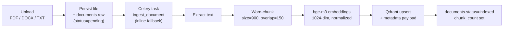
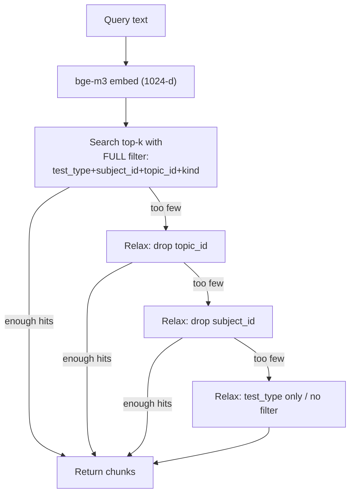

# PrepGenius — Retrieval-Augmented Generation (RAG)

RAG grounds PrepGenius's AI features in real exam material instead of relying on
the LLM's parametric memory alone. It powers **MCQ generation**, **chat (when the
RAG toggle is on)**, **study plans**, and the public **`/ask`** endpoint.

The pipeline is: **ingest documents → chunk → embed with bge-m3 → upsert into
Qdrant with metadata → retrieve top-k with filters → inject context into Qwen
prompts.**

---

## 1. Data Sources

The knowledge base (`prepgenius_kb`) is populated from exam-relevant material,
each tagged with a `kind` for filtered retrieval:

| `kind` | Examples |
|--------|----------|
| `syllabus` | Official FPSC / NTS / PPSC / FGEI EST / CSS syllabi |
| `past_paper` | Past papers and solved question banks |
| `current_affairs` | Pakistan & international current affairs, monthly digests |
| `book` | Standard reference books (Pakistan Affairs, GK, Islamiat, Everyday Science) |
| `notes` | Curated notes, user/admin uploaded PDFs, DOCX, TXT |

Each chunk also carries `test_type`, `subject_id`, and `topic_id` so retrieval
can be scoped to exactly the right slice of material (e.g. CSS → Pakistan
Affairs → Ideology).

---

## 2. Ingestion Pipeline



Steps in detail:

1. **Upload** (`POST /api/v1/documents/upload`): the file is validated
   (extension/MIME, size ≤ `MAX_UPLOAD_MB`), saved under `UPLOAD_DIR`, and a
   `documents` row is created with `status="pending"` plus its tags
   (`test_type`, `subject_id`, `topic_id`, `kind`).
2. **Dispatch**: an `ingest_document` Celery task is queued via Redis. If no
   worker is available, the service runs the **inline fallback** synchronously so
   ingestion still completes (useful for dev / single-node setups).
3. **Text extraction**: PDF/DOCX/TXT are parsed to plain text.
4. **Chunking**: word-based chunking with **chunk size 900 words** and
   **overlap 150 words**. The overlap preserves context across boundaries so a
   fact split across two chunks is still retrievable.
5. **Embedding**: each chunk is embedded with `BAAI/bge-m3` → a 1024-dim,
   L2-normalized vector.
6. **Upsert**: vectors + payload (`doc_id`, `test_type`, `subject_id`,
   `topic_id`, `kind`, `chunk_index`, `text`, `filename`) are upserted into
   Qdrant. Point ids are deterministic per `(doc_id, chunk_index)`, so
   re-ingesting a document replaces its old chunks idempotently.
7. **Finalize**: the `documents` row is updated to `status="indexed"` with
   `chunk_count`; failures set `status="failed"` and emit a `system_logs` entry.

---

## 3. Embedding Model — `BAAI/bge-m3`

| Property | Value |
|----------|-------|
| Model | `BAAI/bge-m3` (sentence-transformers, local) |
| Dimension | 1024 |
| Normalization | L2-normalized (cosine similarity) |
| Device | `EMBEDDING_DEVICE` = `cpu` or `cuda` |
| Cache | HuggingFace cache volume (`models_cache`) |

**Why bge-m3?**

- **Multilingual** — handles **English and Urdu** in the same vector space,
  which is essential for Pakistani exam content: Islamic Studies (Arabic terms,
  Urdu phrasing), Urdu language papers, and mixed-script current affairs.
- **Strong retrieval quality** on dense passage retrieval benchmarks.
- **Runs locally** — no per-call cost and no exam content leaving the cluster
  (data privacy). The model is cached so cold starts are one-time.

Embeddings are computed identically at **ingest time** (chunks) and **query
time** (the user's question / generation request), so the vectors live in a
shared space and cosine similarity is meaningful.

---

## 4. Qdrant Schema & Filtered Retrieval

Collection **`prepgenius_kb`**, cosine distance, 1024-dim. Payload fields
`test_type / subject_id / topic_id / doc_id / kind` are **payload-indexed** for
fast filtering (full schema in `DATABASE.md` §4).

### Retrieval flow



### Progressive filter relaxation

The retriever starts with the **most specific** filter and progressively relaxes
it until it gathers enough high-quality chunks (or runs out of filters):

1. `test_type` + `subject_id` + `topic_id` (+ `kind` if specified)
2. drop `topic_id`
3. drop `subject_id`
4. `test_type` only, then finally unfiltered

This guarantees a topic with sparse material still gets relevant context from the
broader subject/exam rather than returning nothing. Retrieved chunks are ordered
by cosine score and truncated to a token budget before injection.

---

## 5. Context Injection into Prompts

Retrieved chunk `text` fields are concatenated (with light source markers) into a
**context block** that is placed in the system/user prompt sent to Qwen. The
general shape:

```
SYSTEM: You are PrepGenius, an expert tutor for <test_type> exams.
Use ONLY the provided context when it is relevant. If the context is
insufficient, say so rather than inventing facts.

CONTEXT:
[1] (pak-affairs-notes.pdf) The Pakistan Resolution was passed on 23 March 1940...
[2] (css-syllabus.pdf) Pakistan Affairs covers ideology, history, geography...

TASK: <generate 5 MCQs | answer the question | build a study plan>
```

Feature-specific usage:

- **MCQ generation**: context grounds the questions/answers/explanations in real
  syllabus and past-paper material; Qwen returns structured JSON (see
  `AI_INTEGRATION.md`).
- **Chat (RAG toggle on)**: the latest user turn is embedded and used to retrieve
  context, which is prepended before the conversation history.
- **Study plans**: syllabus chunks for the target exam inform the plan structure.
- **`/public/ask`**: the question is embedded, context retrieved with the caller's
  filters, and an answer is generated with citations to source filenames.

When the RAG toggle is **off** (plain chat), no retrieval happens and Qwen
answers from its own knowledge.

---

## 6. Improving Retrieval Quality (future work)

The current pipeline is dense-only retrieval with metadata filtering. Planned
enhancements:

- **Reranking** — add a cross-encoder reranker (e.g. `BAAI/bge-reranker-v2-m3`)
  over the top-N Qdrant hits to reorder by true relevance before injection.
- **Hybrid search** — combine dense vectors with sparse/keyword (BM25 / SPLADE)
  retrieval and fuse scores (RRF). bge-m3 natively supports dense + sparse +
  ColBERT-style multi-vector, so hybrid is a natural extension.
- **Semantic / sentence-aware chunking** — split on headings/sentences rather
  than fixed word windows to reduce mid-fact splits.
- **Query expansion** — expand Urdu/English synonyms and exam terminology before
  embedding.
- **Chunk-level dedup & freshness** — for current affairs, prefer recent chunks
  and drop stale duplicates.
- **Retrieval evaluation** — track hit-rate / MRR against a labeled question set
  to tune `top_k`, chunk size, and overlap empirically.
